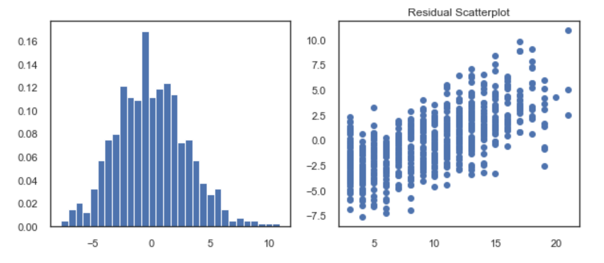

# NBA  Career Length Analysis

### Contributors: 
Nabil Abbas, Harris Nathel

## Goals
Create a linear regression model to determine an NBA player's career length.

### Parameters

For our study we are stating the parameters to only review player data for players who have played ***atleast 3 years in the NBA***.  From those players, the data set will be condense to ***only review seasons from 1979 to 2000***.  Lastly ***only the first 3 years of player NBA season stats*** will be analyzed to determine long term career length.  The parameters have been set as such in order to take into account the following:
   - The game of basketball changed drastically in 1979 with the introduction of the 3 point line.
   - The analyzed data ends at 2000 so that we don’t include players who are still playing (i.e. incomplete data).

## Hypotheses
1. **Higher** Win Shares will have a *positive* impact on career length
2. **Higher** Turnover % will have a *negative* impact on career length 
3. Being **traded** within a players first three years will have a *negative* impact on career length

## Our Results and Insights

### Our Model
Below you can find the output values of our model as well as an explanation of how the model is interacting with the data.

The important values to take note of are the **R-Squared** and **Adjusted R-Squared** values.  Ideally the returns for those values would be closer to ***one*** indicating the linear regression model replicates observed outcomes well. 

There were a number of factors that led to the low R-Squared and Adjusted R-Squared values.  This will be discussed in the **Future Considerations** section.

After running the model, we checked for residuals in our regression as shown below.

To the **left** you can view the ***residual frequency distribution*** and to the **right** you can view the ***residual scatterplot*** of our linear regression model.

To explain what is going on above, there are high residuals values. On top of that, the residual scatterplot follows a pattern (which it shouldn't).  This pattern indicates that when looking at career length of an NBA player, our model underpredicts the player's career length for players with shorter careers, and overpredicts career length for players with longer careers.

### Variable Analysis

#### Win Shares

Win shares attempts to divvy up credit for team success (winning games) to the individuals on the team. 

We expected that WS in each of the first three years would correlate positively to the length of the players career.

In the context of the model, this was proven to be true (especially in a players first and third years) with p-values of 0.004, 0.785 (sophomore slump?), and 0.033.

#### Turnover % and Turnovers

In basketball, a ***turnover*** is when a player losers possession of the ball to the opposing team.  For example, a "turnover" can happen if the other team steals the ball from your immediate possession or if you step out of bounds.

In essence, turnovers aren't good.  But from common knowledge and from our regression model, a high number of turnovers *does not* mean you are going to fail in the league.
The best players tend to have the most turnovers because they have the ball most often and have a higher usage rate.

The last 3 NBA MVPs had the highest number of turnovers in the 2018-2019 season.

From our analysis, rookies historically have a high turnover ratio in their first year since they are just getting accustomed to the league.  Their second and third year provide a better analysis of how their turnovers affect their careers lengths as shown in the following two scatterplot diagrams

The diagrams on the left map **number of turnovers** against ***career length***.  The diagrams on the right map **Turnover %** against ***career length***.  We can observe a positive correlation for the number of turnovers against career length.  As stated earlier this is due to better players having the ball in their possession more.

**Turnover %** on the other hand is *an estimate of number of turnovers per 100 plays*.  In other words, how frequently you will turn the ball over while it is in your possession.  Our model indicates these players will have *shorter* careers as their Turnover % increases. Turnover % is a better indicator of how long a player will last in the league as this is how frequently the player will lose possession of the ball to the other team.

#### Traded Categorical Analysis

We added in this categorical variable to show whether or not the player was traded for each of his first three seasons.

The scatter plots below categorically plot whether or not a player was traded in that year. It shows a negative correlation on the impact it will have on the player's career.  The left plot is a player's first year, the middle plot is the player's second year, and the third plot is a player's third year.

As we expected, being traded had a negative impact on career length. Generally, NBA teams have held onto draft picks that they feel will pan out and have good, long careers.

**NOTE:** This linear representation is not the best indicator to understand the data.  Future revisitation of this project will provide a histogram visualization and analysis of the distribution of career length for traded and untraded players 

#### Rookie Year Age and Career Length's Over Time

The linear regression model also took into account a **player's age** when entering into the the NBA and changes in career length over **time**.  The scatterplots below show the demonstrate these two relationships.

On the left you can see **rookie year age plotted against career**. There is a **strong negative correlation** here.  This also makes sense because mathematically player's who start younger have a few additional years of experience under there belt compared to their older counterparts.

To the right you can see **changes in career length over time**.  According to our model there is an indication that career lengths have slightly but gradually been **increasing** with each year.

## Going Forward and Future Analysis

#### Alternative Models

A **linear model** doesn't consider that the game of **basketball is constantly changing**.
- The NBA values smaller, faster, more athletic players who can shoot three pointers. These attributes were not valued nearly as much in the past.
- **The Three Point Shot** had virtually no correlation to career length in our model because it was not utilized the way it is today.
- Teams trade players (even really good young players) far more than they did in the past. Our “traded” category may not be as linked to career length as it once was.
- Rules about when players can enter the draft have an impact on the age they enter the league. More players were coming to the NBA straight from High School in the late 90’s and early 2000’s. This ended after the the rule that they must go to college first.

Although a different model would be recommended, in order to adjust the **R-Squared** and **Adjusted R-Squared** values, more interaction variables would be studied and included into the model. There are a large number of variables to consider, so to include interaction variables will require future renditions of the linear regression model.

#### Future Considerations

Taking these factors into consideration, a different machine learning model will likely be required to more accurately determine career length of an NBA player going forward.

Additionally, if we were to choose to keep a linear regression model, methods such as ridge, lasso, and "train, test, split" would be incorporated to assist in keeping relevent variables.

Our data set did not include height, weight, draft location, injury history, and other demographics. Future renditions of the model will include this information in the final dataframe to be incorporated into the model.  

Another future consideration to expand the applications of a career length predicting model is to analyze NCAA statistics for up and coming college players.

## Primary Data Source

https://www.kaggle.com/drgilermo/nba-players-stats/version/2?
